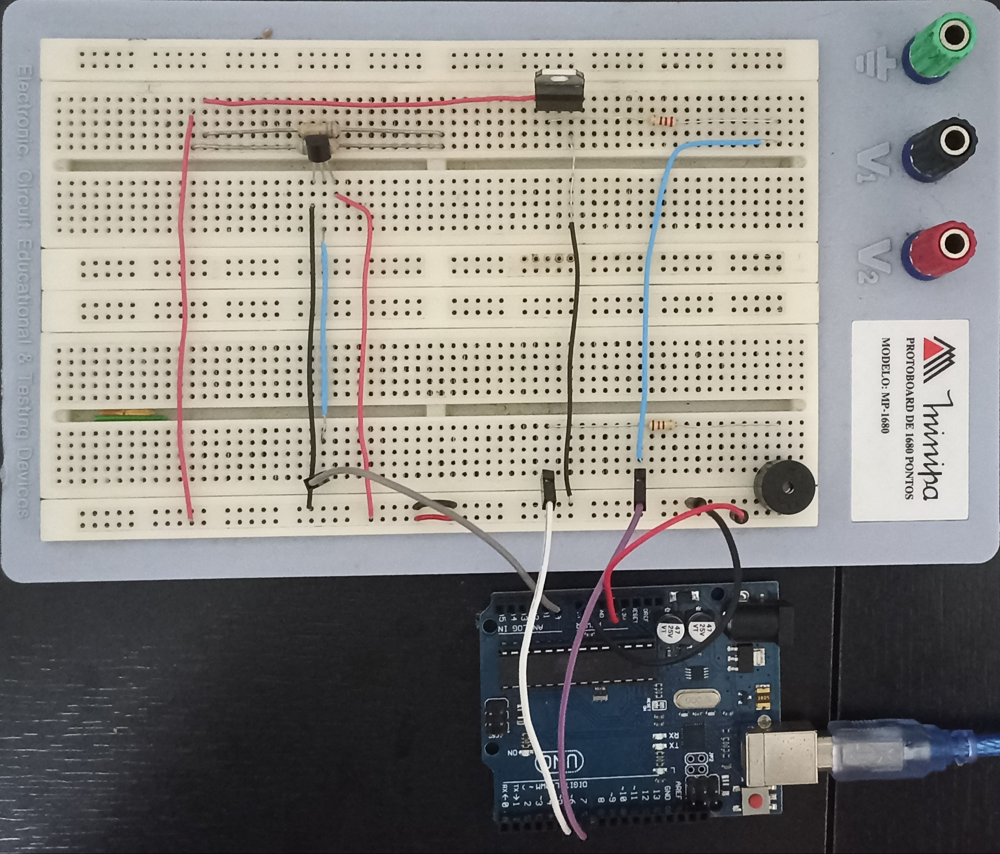

# Aquecimento de café utilizando controle proporcional

Desenvolvimento e circuito e código para controle de aquecimento utilizando Arduino UNO.

## Materiais

### Softwares

- [Arduino IDE](https://www.arduino.cc/en/software)

### Componentes eletrônicos

- $1 \times$ Transistor [TIP120](https://pdf1.alldatasheetpt.com/datasheet-pdf/view/25365/STMICROELECTRONICS/TIP120.html)
- $1 \times$ Sensor de temperatura [LM35](https://www.ti.com/lit/ds/symlink/lm35.pdf?ts=1719491712080&ref_url=https%253A%252F%252Fwww.ti.com%252Fproduct%252FLM35%253Futm_source%253Dgoogle%2526utm_medium%253Dcpc%2526utm_campaign%253Dasc-null-null-GPN_EN-cpc-pf-google-wwe%2526utm_content%253DLM35%2526ds_k%253DLM35%2526DCM%253Dyes%2526gad_source%253D1%2526gclid%253DEAIaIQobChMItoOM3eX7hgMV2FtHAR1R_QN2EAAYASAAEgIDnPD_BwE%2526gclsrc%253Daw.ds%2526bm-verify%253DAAQAAAAJ_____8A_0VswMlwQDYJx4ih8zJeNAl_RHE95tkK14D_nuELaJB7SqUjaaPYkLIC3HgQgzgI-fK1dxhjFcCPYrclEbEG41pQPNiCUpNoYOx1fUGqgHJiGB-9AqJ8DGp1DES7hzsAWbBq2C-edkmWGfHvqoAoqS0m0vUj-N_eHsSYCNuRWfGsv-vradLq11rIC-gbKjSmAXCz8y40v8c4oRqsdN1VnDu3HxptdGBr9PhhOuPKUWEYiI1WN7qF5qxS6tXPTVR3MXmTzDd94u5oj2-RD91JiLx-oFsWN_ruGXRi_8KLyVgY4eyD7qRPqXj77aQMRtVEf50R-681LMJ1Qf51hQgjlbfGrtNLjxg_6VrgNsLMCjzyWZoaJqz_gkd_5J9a3TqyxbaNIILZpBRklxzQOzD1Z8SXuO_wHUW5bqcuW-jG9I-d4zqtw4aTmFtaEJ12G3SAFkmuIYXcD-Ks7Kg4J4ujd0jzgM8hMblOCQDf07Tac99OWQMCRS2gaMJH5I3WpMXpKV6oWl--_4ARAIH1xG-vHuuZylrjNwTySzGZpVewKS9kGn6eLvorEqt63lasBI8NoRxHheSNkakL0vgTJw2uffbwq9FsR1jU1Pvd3UmkxYCfg)
- $1 \times$ [Piezo Buzzer](https://www.mouser.com/datasheet/2/400/ef532_ps-13444.pdf)
- $1 \times$ Resistor $220 \ \Omega$
- $2 \times$ Resistor $6,8 \ \Omega$
- $1 \times$ Resistor $100 \ \Omega$

## Montagem do circuito

## Resultados

O controle implementado não apresenta resultados satisfatórios, visto que a execução do algoritmo de controle não altera o resultado da saída com base na leitura do sensor de temperatura.

> [!IMPORTANT] Notas sobre o sensor de temperatura LM35
> Embora o controle proporcional seja implementado, não foi possível fazer o sistema funcionar adequadamente. Isso se deve ao fato de o sensor de temperatura LM35, embora montado corretamente desde o primeiro uso, não realizar a leitura correta da temperatura. O que leva a acreditar que o mesmo possa estar queimado.

